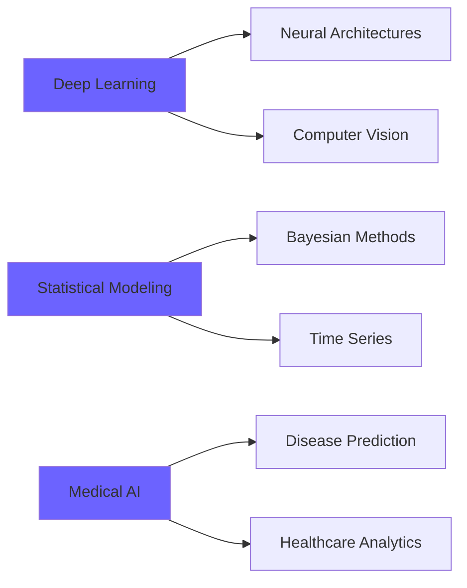

<div align="center">

<!-- Animated Header -->


<!-- Animated Typing Effect -->
<a href="https://git.io/typing-svg"></a>

<!-- Profile Views Counter -->


</div>

---

## 🎯 About Me

```python
class DataScientist:
    def __init__(self):
        self.name = "Dumindu Kumarapeli"
        self.education = "Data Science @ NSBM Green University"
        self.interests = ["Deep Learning", "Statistical Modeling", "Medical AI"]
        self.hobbies = ["Chess ♟️", "Coding Challenges 💻", "Reverse Engineering 🔧"]
        
    def current_focus(self):
        return [
            "🧠 Deep Learning Architectures",
            "📊 Probabilistic & Statistical Modeling",
            "🏥 Healthcare AI Applications",
            "🔮 Predictive Analytics"
        ]
    
    def philosophy(self):
        return "Build models that think. Create systems that learn. 🚀"
```

<div align="center">

### 🎓 Student | 📈 Researcher | 🤖 Builder

</div>

---

## 🛠️ Tech Arsenal

<div align="center">

### **Programming Languages**

<table>
<tr>
<td align="center" width="96">

<br>Python
</td>
<td align="center" width="96">

<br>R
</td>
<td align="center" width="96">

<br>Java
</td>
<td align="center" width="96">

<br>SQL
</td>
</tr>
</table>

### **Machine Learning & Data Science**

<table>
<tr>
<td align="center" width="96">

<br>TensorFlow
</td>
<td align="center" width="96">

<br>Sklearn
</td>
<td align="center" width="96">

<br>Pandas
</td>
<td align="center" width="96">

<br>NumPy
</td>
</tr>
</table>

### **Frameworks & Tools**

<table>
<tr>
<td align="center" width="96">

<br>Spring Boot
</td>
<td align="center" width="96">

<br>Git
</td>
<td align="center" width="96">

<br>VS Code
</td>
<td align="center" width="96">

<br>Docker
</td>
</tr>
</table>

</div>

---

## 🚀 Featured Projects

<div align="center">


</div>

### 🔬 Breast Cancer Prediction Model
 

**Built a high-accuracy ML classifier for early breast cancer detection**
- ✨ Advanced preprocessing & feature engineering
- 🎯 Hyperparameter optimization & model tuning
- 📊 Comprehensive evaluation metrics & visualization
- 👥 **Collaborative group project**

```python
# Key Technologies
tech_stack = ["Scikit-learn", "Pandas", "Matplotlib", "Seaborn"]
accuracy = "95%+"
```

---

### 🦠 Dengue Outbreak Prediction — Hybrid SEIR × ML
 

**Next-gen epidemiological forecasting for Sri Lanka**

🎯 **Objectives:**
- 🧬 Hybrid **SEIR compartmental model** + **Machine Learning**
- 🌡️ Climate & environmental data integration
- 🗺️ Geographic risk mapping & hotspot detection
- ⚡ Short-term outbreak prediction pipeline

```r
# Model Architecture
SEIR_dynamics + ML_correction → Real_time_forecast
         ↓
[Climate Data] + [Epidemiological Records] → Risk Score
```

**Impact:** Early warning system for public health interventions

---

### 🧠 Digital Clone — Cognitive AI Simulation
 

**AI-driven behavioral & cognitive modeling system**

🔮 **Vision:**
- 🤖 Behavioral pattern simulation
- 🧩 Adaptive decision-making engine
- 🎭 Personality & reasoning style replication
- 🔬 Deep learning + cognitive science fusion

**Status:** *Pending*

<div align="center">


</div>

---

## 🎯 Current Learning Path

<div align="center">



</div>

---

## 💡 Philosophy & Vision

<div align="center">

> ### *"Build models that think. Create systems that learn. Stay hungry, stay evolving."*

<br>

<table>
<tr>
<td align="center">

<br><b>Think Deep</b>
<br><sub>Question assumptions</sub>
</td>
<td align="center">

<br><b>Build Smart</b>
<br><sub>Engineer solutions</sub>
</td>
<td align="center">

<br><b>Learn Always</b>
<br><sub>Never stop growing</sub>
</td>
</tr>
</table>

</div>

---

## 🤝 Let's Connect

<div align="center">

<a href="https://linkedin.com/in/dumindu-kumarapeli">

</a>
<a href="mailto:duminduku.25@gmail.com">

</a>
<a href="#">

</a>

</div>

---

<div align="center">

### 🚀 Always learning. Always building. Always evolving.


**Made with ❤️ and ☕ by Dumindu**

</div>
