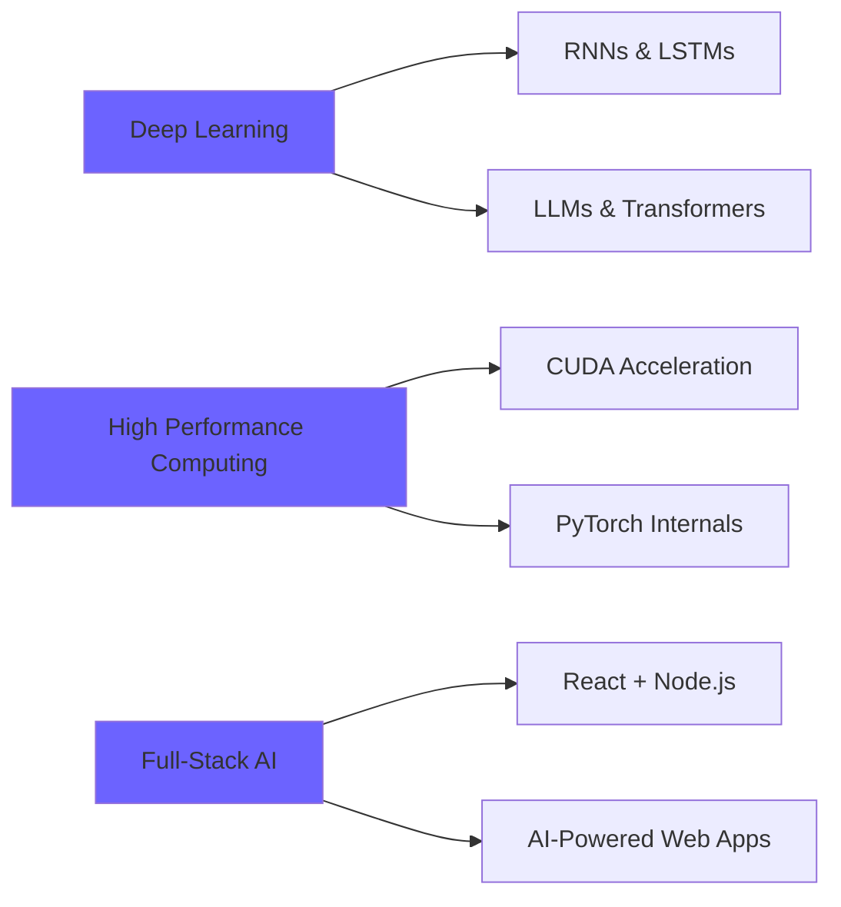

<div align="center">

<!-- Animated Header -->


<!-- Animated Typing Effect -->
<a href="https://git.io/typing-svg"></a>

<!-- Profile Views Counter -->


</div>

---

## 🎯 About Me

```python
class DataScientist:
    def __init__(self):
        self.name = "Dumindu Kumarapeli"
        self.education = "BSc (Hons) Data Science @ NSBM Green University"
        self.role     = "Assistant Secretary @ NSBM AI Association (NAIA)"
        self.interests = ["Deep Learning", "Statistical Modeling", "Medical AI"]
        self.hobbies = ["Chess ♟️", "Coding Challenges 💻", "Reverse Engineering 🔧"]

    def current_focus(self):
        return [
            "🧠 LLMs, RNNs & PyTorch",
            "⚡ CUDA Acceleration",
            "🌐 Full-Stack AI Applications (React + Node.js)",
            "🔮 Predictive & Probabilistic Modeling"
        ]

    def philosophy(self):
        return "Build models that think. Create systems that learn. 🚀"
```

<div align="center">

### 🎓 Student | 📈 Researcher | 🤖 Builder

</div>

---

## 🛠️ Tech Arsenal

<div align="center">

### **Programming Languages**

<table>
<tr>
<td align="center" width="96">

<br>Python
</td>
<td align="center" width="96">

<br>R
</td>
<td align="center" width="96">

<br>Java
</td>
<td align="center" width="96">

<br>JavaScript
</td>
</tr>
</table>

### **Machine Learning & Data Science**

<table>
<tr>
<td align="center" width="96">

<br>TensorFlow
</td>
<td align="center" width="96">

<br>PyTorch
</td>
<td align="center" width="96">

<br>Sklearn
</td>
<td align="center" width="96">

<br>Pandas
</td>
<td align="center" width="96">

<br>NumPy
</td>
</tr>
</table>

### **Frameworks & Tools**

<table>
<tr>
<td align="center" width="96">

<br>FastAPI
</td>
<td align="center" width="96">

<br>Spring Boot
</td>
<td align="center" width="96">

<br>React
</td>
<td align="center" width="96">

<br>Node.js
</td>
<td align="center" width="96">

<br>Git
</td>
</tr>
</table>

### **Visualization & BI**

<table>
<tr>
<td align="center" width="96">

<br>Matplotlib
</td>
<td align="center" width="96">

<br>Plotly
</td>
<td align="center" width="96">

<br>Power BI
</td>
<td align="center" width="96">

<br>Streamlit
</td>
</tr>
</table>

</div>

---

## 🚀 Featured Projects

<div align="center">

</div>

### 🧠 DataSense — AI-Powered Data Analysis Platform
 

**An intelligent platform that automates data analysis workflows and delivers actionable insights**

- 🤖 AI-driven insight generation from raw datasets
- 📊 Interactive visualizations and automated reporting
- ⚡ Built with FastAPI backend + Streamlit frontend
- 🔗 Modular pipeline architecture for scalability

```python
tech_stack = ["Python", "FastAPI", "Streamlit", "Pandas", "Plotly", "LLMs"]
focus      = "Making data analysis accessible to non-technical users"
```

---

### 🌌 Celestial Object Classifier
 

**A RandomForest-based classifier for identifying celestial objects from astronomical datasets**

- 🔭 Classifies stars, galaxies, and quasars with **99.19% accuracy**
- 🧪 Advanced feature extraction using Convolutional Neural Networks
- 📈 Extensive evaluation: confusion matrices, ROC curves, precision-recall analysis
- 🛰️ Trained on spectroscopic survey data

```python
tech_stack = [ "Scikit-learn", "Matplotlib", "Seaborn", "NumPy"]
accuracy   = "99.19%"
task       = "Multi-class Astronomical Object Classification"
```

---

### ⚡ Superconductivity Critical Temperature Prediction
 

**Predicting the superconducting critical temperature (Tc) of materials using ML regression**

- 🧲 Regression modeling on superconductor material properties
- 🔬 Feature engineering from chemical composition descriptors
- 📊 Benchmarked across multiple algorithms (RF, XGBoost, SVR, and more)
- 🎯 Hyperparameter tuning for optimal predictive performance

```python
tech_stack = ["Python", "Scikit-learn", "Pandas", "NumPy", "Matplotlib", "SciPy"]
task       = "Critical Temperature (Tc) Regression"
dataset    = "UCI Superconductivity Dataset"
```

<div align="center">

</div>

---

## 🎯 Current Learning Path

<div align="center">


```mermaid
graph LR
    A[Deep Learning] --> B[RNNs & LSTMs]
    A --> C[LLMs & Transformers]
    D[High Performance Computing] --> E[CUDA Acceleration]
    D --> F[PyTorch Internals]
    G[Full-Stack AI] --> H[React + Node.js]
    G --> I[AI-Powered Web Apps]

    style A fill:#6C63FF
    style D fill:#6C63FF
    style G fill:#6C63FF
```

</div>

---

## 💡 Philosophy & Vision

<div align="center">

> ### *"Build models that think. Create systems that learn. Stay hungry, stay evolving."*

<br>

<table>
<tr>
<td align="center">

<br><b>Think Deep</b>
<br><sub>Question assumptions</sub>
</td>
<td align="center">

<br><b>Build Smart</b>
<br><sub>Engineer solutions</sub>
</td>
<td align="center">

<br><b>Learn Always</b>
<br><sub>Never stop growing</sub>
</td>
</tr>
</table>

</div>

---

## 🤝 Let's Connect

<div align="center">

<a href="https://www.linkedin.com/in/dumindu-kumarapeli-7a4636309">

</a>
<a href="mailto:duminduku.25@gmail.com">

</a>
<a href="#">

</a>

</div>

---

<div align="center">

### 🚀 Always learning. Always building. Always evolving.


**Made with ❤️ and ☕ by Dumindu**

</div>
